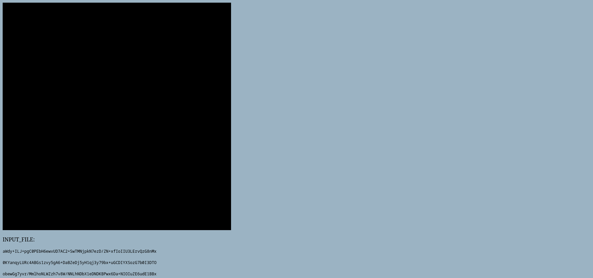
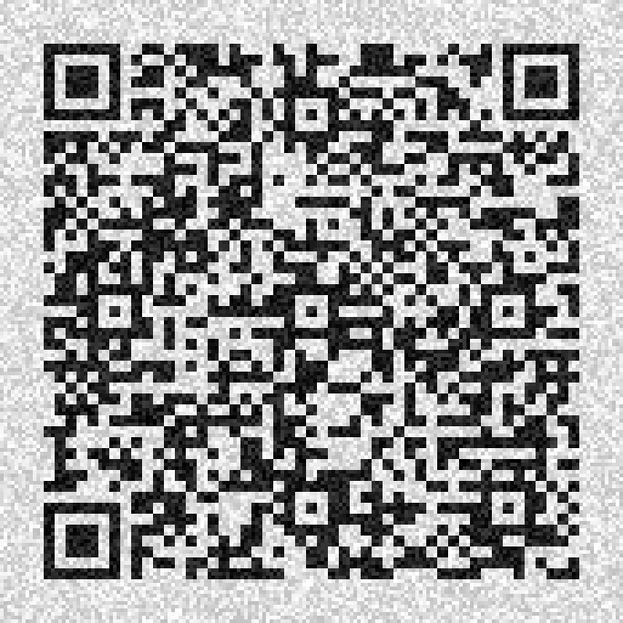
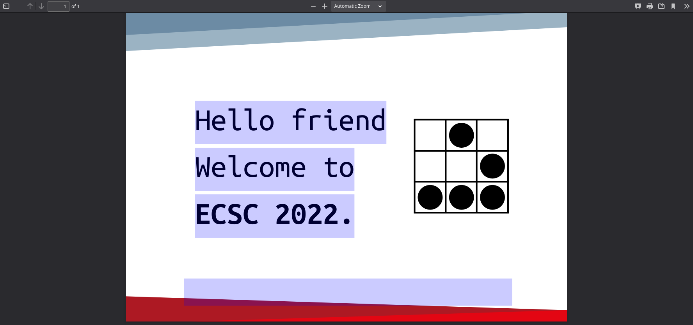
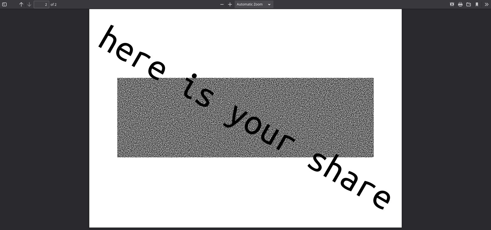

# Visual Steganography
> Five files and five shares hidden inside. You need to recover at least three of them to obtain the flag. Each share is a binary image. Enjoy and good luck!
> [visual_stego.zip](https://hack.cert.pl/files/visual_stego-8dab1c85b0c0795d664a12ae9dc3756a1187be1c.zip)

## Recovering the share from *page.html*
Opening *page.html* in a web browser results in the following view:

Hovering over the black square results in some pixels turning gray for a moment. Looking at the source of the page reveals an enormous style sheet with *:hover* rules for *td* tags with various ids, which is responsible for the hover behaviour. To reveal hidden image, we can delete every occurrence of *:hover* in the file, e.g. using *Replace all* function in a text editor. Looking at the page again we can see a QR code:

Reading the code, e.g. using CLI tool *zbarimg*, reveals the following string:
`openssl enc -d -aes-256-cbc -iv c71261bdefb66c34851eeb130b9a839f -K 4171c25a5e1f3fa6acb84540ecec0fd45ab0978a751fbcfebb89f232b139bfc1 -in INPUT_FILE -base64 -out OUTPUT_SHARE.png`
The contents of *INPUT_FILE* can be found right under the QR code, we can simply copy it and paste it to *INPUT_FILE*. After running the above command, we end up with our first share saved as *OUTPUT_SHARE.png*

## Recovering the share from *poster.pdf*
Selecting all text on the first page of the document reveals invisible text at the bottom that says "Your share is on the second page." despite the fact that *poster.pdf* seemingly has only one page:

Using a tool like hexedit we can find the string "/Pages\n/Count 1" in the file and change it to "/Pages\n/Count 2" to reveal the 2nd page:

Now all that's left to do is to extract the image from the 2nd page to a separate file, e.g. using *pdfimages*:
```sh
$ pdfimages -f 2 -l 2 poster.png .
```
This way we've obtained the 2nd share which resides in the file *.-000.pbm*


## Recovering the share from *program*
*program* is a ELF64 not stripped executable. The *main* function calls a function called *row* 300 times, passing the iterations no. as an argument:
```gdb
Dump of assembler code for function main:
   0x000000000011ab75 <+0>:     push   rbp
   0x000000000011ab76 <+1>:     mov    rbp,rsp
   0x000000000011ab79 <+4>:     sub    rsp,0x10
   0x000000000011ab7d <+8>:     mov    DWORD PTR [rbp-0x4],0x0
   0x000000000011ab84 <+15>:    jmp    0x11ab94 <main+31>
   0x000000000011ab86 <+17>:    mov    eax,DWORD PTR [rbp-0x4]
   0x000000000011ab89 <+20>:    mov    edi,eax
   0x000000000011ab8b <+22>:    call   0x1135 <row>
   0x000000000011ab90 <+27>:    add    DWORD PTR [rbp-0x4],0x1
   0x000000000011ab94 <+31>:    cmp    DWORD PTR [rbp-0x4],0x12b
   0x000000000011ab9b <+38>:    jle    0x11ab86 <main+17>
   0x000000000011ab9d <+40>:    mov    eax,0x0
   0x000000000011aba2 <+45>:    leave  
   0x000000000011aba3 <+46>:    ret    
End of assembler dump.
```
The disassembly of function *row* has over 288000 (sic!) lines so we'll open it in a pager:
```sh
$ gdb program -ex 'disas row' -ex 'quit' | less
```
It seems that starting with *row+73* the function is divided into 300 blocks of 961 instructions, where the initial 960 increment a dword located at either [rbp-0x4] or [rbp-0x8] and the last instruction jumps to the end of the function which looks like this:
```gdb
   0x000000000011ab56 <+1153569>:       mov    ecx,DWORD PTR [rbp-0x8]
   0x000000000011ab59 <+1153572>:       mov    edx,DWORD PTR [rbp-0x4]
   0x000000000011ab5c <+1153575>:       mov    eax,DWORD PTR [rbp-0x14]
   0x000000000011ab5f <+1153578>:       mov    esi,eax
   0x000000000011ab61 <+1153580>:       lea    rdi,[rip+0x4a0]        # 0x11b008
   0x000000000011ab68 <+1153587>:       mov    eax,0x0
   0x000000000011ab6d <+1153592>:       call   0x1030 <printf@plt>
   0x000000000011ab72 <+1153597>:       nop
   0x000000000011ab73 <+1153598>:       leave  
   0x000000000011ab74 <+1153599>:       ret    
End of assembler dump.
```
where the string loaded into *rdi* is "Row %d has %d white pixels and %d black pixels.\n". Given that the value from [rbp-0x4] is loaded into edx (3rd argument) and the value from [rbp-0x8] into ecx (4th argument) we can deduce that each block of *add* instructions represents subsequent pixels in the corresponding row - the pixel is white if the value under [rbp-0x4] is incremented and black otherwise. Now we can dump the part of the function responsible for incrementing these variables and convert it to image using Python with pillow module. The dump can be done using:
```sh
$ gdb program -ex 'disas *row+73,+(1153568-73)' -ex 'quit' > dump.txt
```
Now let's run the following script to save the share in *program_share.png*:
```py
from PIL import Image

with open('dump.txt', 'rt') as f:
	dump = f.readlines()

im = Image.new('RGB', (960, 300))

i = 0
# skip gdb's banner
while '<row+' not in dump[i]:
	i += 1

# skip 'End of assembler dump' line
instructions = dump[i:-1]

x, y = 0, 0
for line in instructions:
	if 'nop' in line or 'jmp' in line:
		x = 0
		y += 1
		continue
	color = 255 if '-0x4]' in line else 0
	im.putpixel((x, y), (color,) * 3)
	x += 1

im.save('program_share.png')
```

## Combining the shares
The name of the challenge is a reference to visual cryptography, a technique using which we can break a black and white image into n shares, being binary images, such that superimposing at least t of them results in the possibility of recovering the original image. We can superimpose the recovered shares using ImageMagick and save the result as *composed.png* with the following command:
```sh
$ convert OUTPUT_SHARE.png '.-000.pbm' -transparent white program_share.png -transparent white -layers flatten composed.png
```

## Flag
`ecsc{St3g4n0gr4pHy_eXp3r7}`
