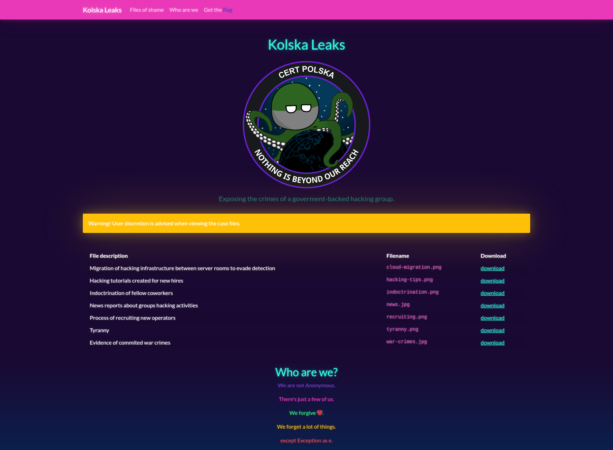

# Kolska Leaks
> Finally. The notorious hacking group got what had been coming to them. Somebody hacked them and released a bunch of their personal files in a info dump called "Kolska Leaks".
Check if they have published anything interesting besides the exfiltrated files:
https://kolska-leaks.ecsc22.hack.cert.pl/

## Recon
We are greeted with the following website:

'Get the flag' button redirects to */flag* route which informs us that we're not an admin.
The file download links seem interesting as they point to */download* route with a query parameter *filename* which hints a potential LFI vulnerability:
`https://kolska-leaks.ecsc22.hack.cert.pl/download?filename=files/cloud-migration.png`
*except Exception as e* at the bottom of the page hints the usage of Python.

## Exploiting LFI
Python applications usually come with *requirements.txt* file that contains a list of external packages required by the app. We could therefore try to download this file by navigating to the following path to see if the */download* route actually has an LFI vulnerability:
`https://kolska-leaks.ecsc22.hack.cert.pl/download?filename=requirements.txt`
This indeed allows us to see the contents of *requirements.txt* from which we know that the app was written in Flask framework. After trying various filenames we'll eventually discover that it's possible to download *app.py* which contains the website's source.

## Investigating the source code
Lines 25-30 of *app.py* contain the logic behind the */flag* route:
```py
@app.route("/flag")
def get_flag():
    if session.get("is_admin") == 1:
        return "Welcome to our family. " + os.environ["FLAG"]
    else:
        return "You're not an admin :("
```
Flask sessions are stored in cookies cryptographically signed using a key stored in app's *SECRET_KEY* configuration variable. Luckily for us, the key is included in the source code, which means we can use it to forge a valid session cookie with *is_admin* value set to 1:
```py
app.config['SECRET_KEY'] = "p5VAmUfaP71Zpy1g"
```

## Forging the cookie and getting the flag
After the following code as *app.py*, running it using `$ FLASK_APP=app.py flask run` and navigating to http://127.0.0.1:5000/ we can copy the *session* cookie from our local application to Kolska Leaks and successfully read the flag from the */flag* route.
```py
from flask import Flask, session

app = Flask(__name__)
app.config['SECRET_KEY'] = 'p5VAmUfaP71Zpy1g'


@app.route('/')
def index():
    session['is_admin'] = 1
    return ''
```

## Flag
`ecsc{organization_is_only_as_strong_as_its_memes}`
