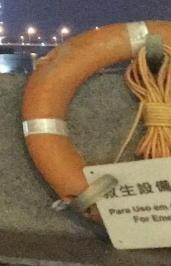

# Geoguessr Normal Mode
> I like the city! The flag is LITCTF{latitude,longtitude} rounded to the third decimal place. (Example: LITCTF{42.444,-71.230})
> 
> Downloads
> [geoguessrnormal.png](https://drive.google.com/uc?export=download&id=1I5HJIy0HMBpYlohuJdjeITiYlIw5s1Y0)

## Determining the city
The first hint is the plaque in front of the lifebuoy in the bottom-right corner of the picture: 
It contains text in 3 languages: Chinese, Portuguese and English, in this exact order, which suggest that the picture was taken in Asia in a place where Portuguese is a widely-used (or even official) language. [This Wikipedia article](https://en.wikipedia.org/wiki/Portuguese_language_in_Asia) lists such places with Macau - a former Portuguese colony, now a special administrative region and city in China - being the only Chinese region among them.

## Identifying the buildings
The most distinct building visible in the picture is the illuminated tower with a red light on top of it: 
Scrolling through the results of query "macau tower with a red light on top" in Google Images eventually leads to a picture with familiar-looking building, which is a cover of an article titled ["How Macau became the world's casino capital"](https://theconversation.com/how-macau-became-the-worlds-casino-capital-108866), suggesting we should be looking for a casino. After looking at photos of various casinos around the city, we can identify the tower as Casino Lisboa.

## Determining the coordinates
Now to identify the exact spot from which the photo was taken: we know that there must be a waterbody between the casino and photographer's location and that the photographer stands next to a stone wall with a lifebuoy. The waterbody must be the Nam Van Lake and the photo was probably taken from its west coast: 
Indeed, dropping the Google Maps street view at exactly `22.189142, 113.538586` yields an image taken at night, with the tower as well as the lifebuoy in it.

## Flag
`LITCTF{22.189,113.539}`
