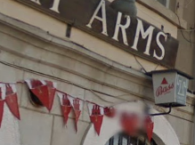

# Geoguessr Warm-up
> My friend told me to meet him here. Where is he???? The flag is LITCTF{latitude,longtitude} rounded to the third decimal place. (Example: LITCTF{42.444,-71.230})
> 
> Downloads
> [geoguessrwarmup.png](https://drive.google.com/uc?export=download&id=1a0e58oRCqNVkFjqATku9xl9tNnvU43uP)

## Determining the region
A garland of characteristic flags can be seen under the "gh arms" signboard: 
Googling "white-red flag with a red castle" immediately yields the flag of Gibraltar, which looks exactly the same as the mentioned flags.

## Determining the coordinates
Searching for "Gibraltar gh arms" in Google Maps returns 2 results, only one of which actually contains the "gh": "Edinburgh Arms". Taking a look at the street view confirms that this indeed is the place we're looking for: 

## Flag
`LITCTF{36.122,-5.350}`
