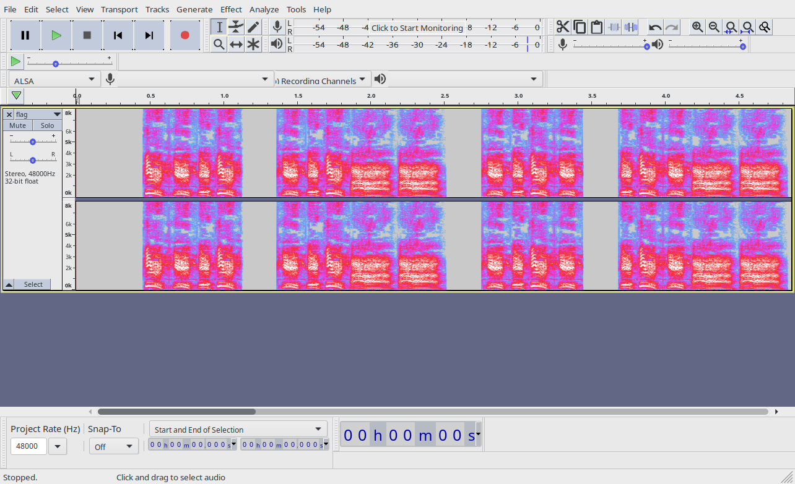

# Trash Royale
> Find the flag, and make sure its wrapped in LITCTF{}
> 
> Ugh, I keep forgetting my password for [https://spectacle-deprive4-launder.herokuapp.com/](https://spectacle-deprive4-launder.herokuapp.com/), so I will just it here.
> Username: LexMACS and Password: !codetigerORZ

## Downloading the game
After logging in using the provided credentials and navigating to `/home` we can view the page source to find a hidden paragraph with link to `/3ar1y-4cc35s`. From there, we can download the `trashroyale.exe` file.
In `/home`, a morse-encoded text can be seen at the top of the page. This is a hint that will be important later.

## Extracting assets from the executable
Browsing through the results of running POSIX `strings` on the executable, we can find out that the app was created using version 5.1 of a tool called PyInstaller. [This script](https://raw.githubusercontent.com/extremecoders-re/pyinstxtractor/master/pyinstxtractor.py), said to support PyInstaller 5.1, can be used to extract assets from `trashroyale.exe`. After running it, a file called `flag.mp3` will be present in `trash-royale.exe_extracted/assets` directory.

## Finding the flag
The spectrogram of `flag.mp3` consists of blocks, each of which is made up of several long and short components: 
This structure, alongside aforementioned hint on the website, hints that it might be the flag encoded using Morse code. Putting the sequence of dots and dashes into [CyberChef](https://gchq.github.io/CyberChef/#recipe=From_Morse_Code('Space','Line%20feed')&input=Li4uLiAuLi4tLSAuLi4uIC4uLi0tIC4uLi4gLi4uLS0gLi4uLiAuLi4uLSAuLS0gLSAuLi4uIC4tLiAuIC4gLS4tLiAuLS4gLS0tIC4tLSAtLg) gives us the text: `H3H3H3H4WTHREECROWN`.

## Flag
`LITCTF{H3H3H3H4WTHREECROWN}`
