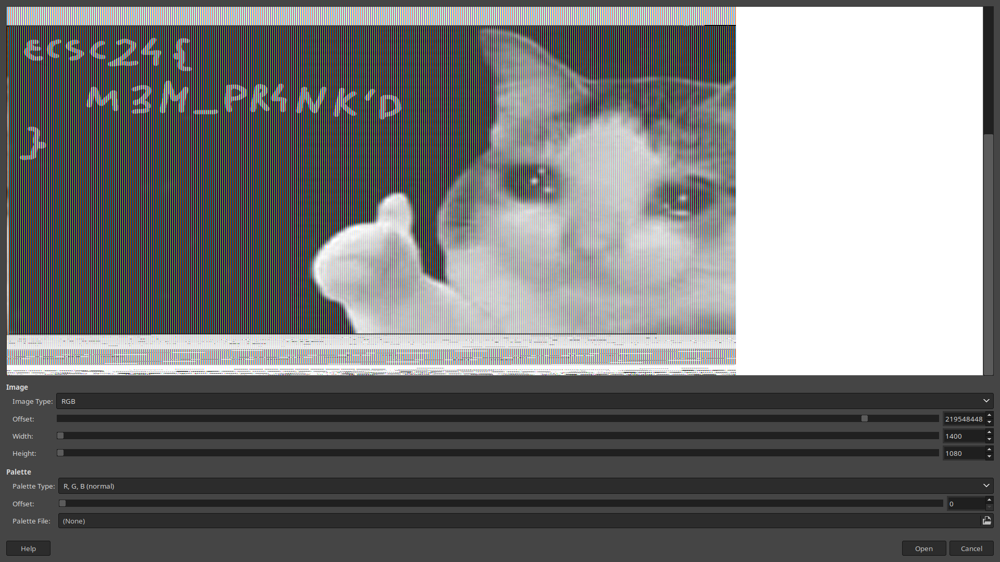

# Office Retribution

> Our staff security engineer has a rather nasty habit of changing our wallpapers whenever we leave our PCs unlocked.
Like, we get it - not the best practice, but it's getting annoying. I'd like to report him to HR, but I don't have any proof at this time. I've managed to capture a RAM dump from his PC, can you check whether there's anything that we could use a proof?
`office-retribution.raw.lrz` will expand to about a gigabyte.
>
> [office-retribution.raw.lrz](https://hack.cert.pl/storage/office-retribution-50868c9be28a0922ab52782e698f8ac4eb520fbf.raw.lrz)

## Solution
The challenge description mentions wallpapers, so the goal is probably to retrieve the wallpaper from the dump. To do that, we need to first extract the memory dump of `explorer.exe`. Using Volatility 3, we first find the PID of `explorer.exe`:
```
$ volatility -f office-retribution-50868c9be28a0922ab52782e698f8ac4eb520fbf.raw VerInfo | grep 'explorer.exe'
1332ressexplorer.exe    0xd40000PDB scanExplorer.EXEd   -       -       -       -
1332    explorer.exe    0x77920000      ntdll.dll       -       -       -       -
```
which seems to be `1332`. Now we can dump the memory of this process only:

`$ volatility -f office-retribution-50868c9be28a0922ab52782e698f8ac4eb520fbf.raw -o explorer_dump windows.memmap.Memmap --pid 1332 --dump`

All that's left to do after that is loading this dump into GIMP as raw image and playing with the width and offset. The following values seem to work:



## Flag
`ecsc24{M3M_PR4NK'D}`
