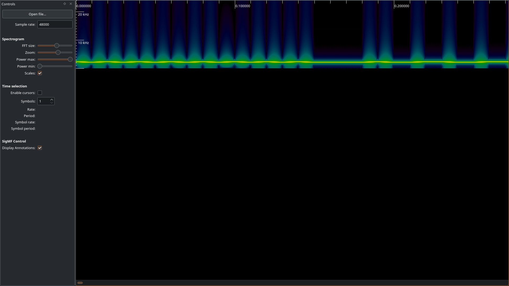
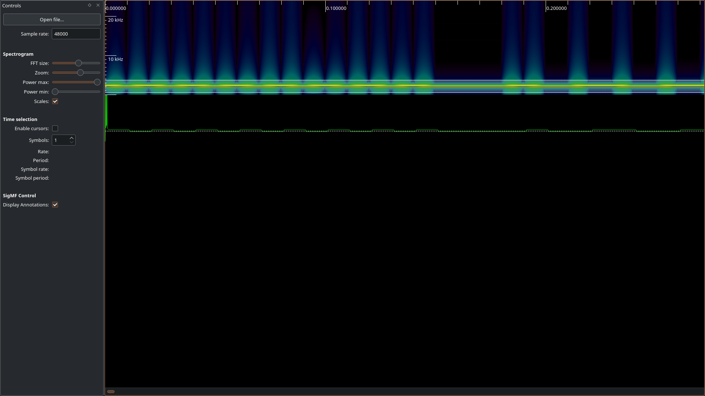
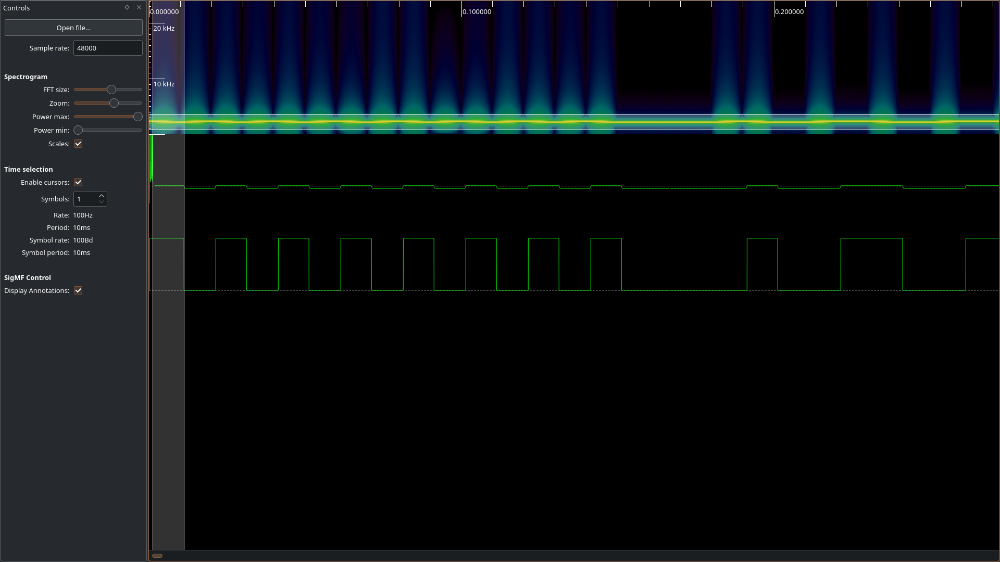

# Random noise
> ### Category: misc
>
> While listening to my favourite radio station, the wonderful music has been interrupted by this weird radio signal. We only know that the embedded message is generated using this driver:
>
> ```py
> def generate_packet(sequence_no, data):
>     packet = b'\x13\x37' + b'\xbe\xef' # SRC and DST
>     packet += sequence_no.to_bytes(1, 'big') # sequence number
>     packet += len(data).to_bytes(1, 'big') + data.encode() # len + data
>     packet += zlib.crc32(packet).to_bytes(4, 'big') # crc
>     return b'\xaa\xaa' + packet
> ```
>
> ### Attachments
> `RF_48ksps_100bps.float`
## Initial analysis
We're given a radio signal data in the form of a float file with (as the name suggests) 48000 samples per second and the baudrate of 100. From the challenge description we know that it's binary data that's encoded in the signal, so we might assume that a scheme like frequency-shift keying or amplitude-shift keying has been used to encode the data. As the former one is more popular, we might want to first check if it was in fact the one used here.
## FSK demodulation
There are multiple ways to demodulate a binary FSK signal. I've used [inspectrum](https://github.com/miek/inspectrum) to do so. For inspectrum to correctly recognize that the file consists of 32-bit floats, we have to change its extension from .float to .f32. After that, we can load the file and set the sample rate to 48kHz:



Next, right-click the spectrogram and choose `Add derived plot > Add frequency plot`. You will notice a signal continuously switching between two values below the spectrogram. A horizontal window will also appear on the spectrogram - drag it down until the bottom part of the frequency plot is below the white dashed line, but the upper part is still above this line:



Then we need to convert the data from the frequency plot into a stream of 0s and 1s. Right click on the frequency plot and click `Add derived plot > Add threshold plot`. Now tick `Enable cursors` on the panel on the left hand side and drag a border of the cursor that appears until the `symbol rate` is `100Bd` (as hinted by the filename). Next align the end of the cursor to the end of the first symbol:



Finally, increase the number of symbols to cover the whole threshold plot (or actually, since inspectrum will not generate symbols for the whole signal, as many full bytes as possible - we will fix that issue later), that is to 3064. Now right-click once more, choose `Extract symbols > Copy to clipboard` and paste the values to a file called `bitstring`.
## Decoding the packets
To decode the packets data, I'll write a Python script. First we need a way to read the bit string and convert it to a bytes object:
```py
def bits_to_bytes(bitstring):
    return bytes([int(''.join(bitstring[i:i+8]), 2) for i in range(0, len(bitstring), 8)])


with open('bitstring', 'rt') as f:
    data = bits_to_bytes([x.strip() for x in f.read().strip().split(',') if x.strip() != ''])
```
Next we need a class to represent a packet. As it will have a lot of fields, but only few methods, I've decided to make it a dataclass (note that for this code to work, we need to import `dataclass` from `dataclasses` module and `crc32` from `zlib`):
```py
@dataclass
class Packet:
    header: int
    src: int
    dst: int
    seq_no: int
    length: int
    data: bytes
    crc: int

    @property
    def correct(self):
        return self.expected_crc == self.crc

    @property
    def expected_crc(self):
        return crc32(self.src.to_bytes(2, "big") + self.dst.to_bytes(2, "big") + self.seq_no.to_bytes(1, "big") + self.length.to_bytes(1, "big") + self.data)
```
To parse a single packet from a list of bytes, I'll use the following function. It will return the packet and the rest of the list from which subsequent packets can be parsed (note that this function requires `struct` to be imported):
```py
def parse_packet(bytestream):
    [h1, h2, s1, s2, d1, d2, no, l, *rest] = bytestream
    header = (h1 << 8) + h2
    src = (s1 << 8) + s2
    dst = (d1 << 8) + d2
    data = bytes(rest[:l])
    cs = rest[l:l+4]
    cs = struct.unpack('>I', bytes(cs))[0]
    return Packet(header, src, dst, no, l, data, cs), rest[l+4:]
```
Finally, we need some code to actually construct and print the flag:
```py
packets = {}

while len(data) > 0:
    packet, data = parse_packet(data)
    seq_no = packet.seq_no
    if packet.correct:
        print(f'Found correct packet with sequence number {seq_no}')
        if packets.get(seq_no) is None:
            packets[seq_no] = []
        packets[seq_no].append(packet)

lo_seqno = min(packets.keys())
hi_seqno = max(packets.keys())
assert len(packets) == hi_seqno - lo_seqno + 1

flag = b''

options = [v for k, v in sorted(packets.items())]

for op in options:
    assert len(op) == 1
    flag += op[0].data

print(flag.decode())
```
However, this code will fail:
```
$ python3 test.py 
Found correct packet with sequence number 4
Found correct packet with sequence number 5
Found correct packet with sequence number 10
Found correct packet with sequence number 12
Found correct packet with sequence number 13
Found correct packet with sequence number 11
Found correct packet with sequence number 0
Found correct packet with sequence number 7
Found correct packet with sequence number 6
Found correct packet with sequence number 9
Found correct packet with sequence number 8
Found correct packet with sequence number 15
Found correct packet with sequence number 14
Found correct packet with sequence number 1
Found correct packet with sequence number 2
Traceback (most recent call last):
  File "/home/ksaweryr/ctf/openecsc/round2/random_noise/test.py", line 47, in <module>
    packet, data = parse_packet(data)
                   ^^^^^^^^^^^^^^^^^^
  File "/home/ksaweryr/ctf/openecsc/round2/random_noise/test.py", line 33, in parse_packet
    cs = struct.unpack('>I', bytes(cs))[0]
         ^^^^^^^^^^^^^^^^^^^^^^^^^^^^^^
struct.error: unpack requires a buffer of 4 bytes
```
## Fixing the final packet
Remember how we couldn't extract all of the bits from the signal? It turns out that last 2 bytes of the final packet are missing and therefore we can't extract the CRC. Upon analysis, we can figure out that the final packet has sequence number 3 and we haven't encountered a correct packet with sequence number 3 before. Therefore we can assume that this packet is supposed to be correct and we can just modify `parse_packet` to set the correct CRC in case we don't have enough bytes:
```py
def parse_packet(bytestream):
    [h1, h2, s1, s2, d1, d2, no, l, *rest] = bytestream
    header = (h1 << 8) + h2
    src = (s1 << 8) + s2
    dst = (d1 << 8) + d2
    data = bytes(rest[:l])
    cs = rest[l:l+4]
    try:
        cs = struct.unpack('>I', bytes(cs))[0]
        packet = Packet(header, src, dst, no, l, data, cs)
    except struct.error:
        cs = None
        packet = Packet(header, src, dst, no, l, data, cs)
        packet.crc = packet.expected_crc
    return packet, rest[l+4:]
```
Running the code now prints the correct flag. The complete script can be found in [solve.py](solve.py) alongside the [bitstring](bitstring) file.
## Flag
`openECSC{f5k_m0dul4710n_15_n07_50_h4rd_70_5p07_4nd_15_4l50_4n_3ff3c71v3_w4y_70_5h4r3_53cr375_f5756e7a}`