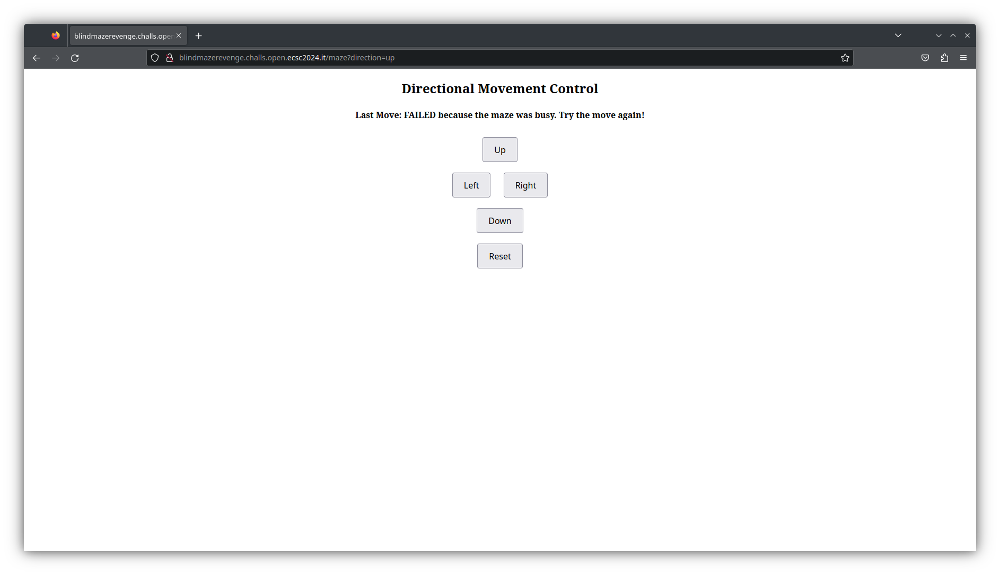

# Revenge of the Blind Maze
> ### Category: misc
>
> Welcome back to the blind maze, this time you'll have a harder time finding the flag, good luck.
>
> Site: [http://blindmazerevenge.challs.open.ecsc2024.it](http://blindmazerevenge.challs.open.ecsc2024.it)
>
> ### Attachments
> `capture.pcap`
## Initial recon
We're given a website on which we can press buttons to move through a maze. However, sometimes a move will fail and has to be repeated:

We also have a pcap file which contains requests that eventually lead to the flag. However, some responses in this file also "failed", so we must exclude those when performing our requests.
## Dumping the correct path
We can see that if the movement fails (and only then), the response will contain the string `FAILED`. Therefore to find the packets that constitute the correct path, we need to filter packets that are HTTP responses (`http.response`) and don't contain the string `FAILED` (`!frame contains "FAILED"`).
## Automating the solution
It turns out that to get to the flag we need to make 162 requests (actually more when we include moves that have to be repeated). Therefore we won't do it by hand, rather we'll write a Python script to send the correct requests for us.
### Reading pcap file in Python
To read the pcap file and use Wireshark filters, we can use [pyshark](https://github.com/KimiNewt/pyshark) (note that it still requires tshark to be installed to work). After importing pyshark, we can read the pcap file using:
```py
cap = pyshark.FileCapture('./capture.pcap', display_filter='http.response && !frame contains "FAILED"')
```
Now to get the directions, we can use the URI to which the given response corresponds, since the movement direction is passed as a request parameter:
```py
directions = [p.http.response_for_uri.split('=')[1] for p in cap]
```
### Sending the requests
For sending the requests, the popular `requests` module should be enough. Note that we need to make use of a `Session` object to have the cookies saved and reused in subsequent requests automatically. A simple loop that sends requests and prints the flag at the end would look like this:
```py
with requests.session() as s:
    s.get('http://blindmazerevenge.challs.open.ecsc2024.it/')
    for d in directions:
        assert d in ['start', 'up', 'down', 'left', 'right']
        resp = s.get('http://blindmazerevenge.challs.open.ecsc2024.it/maze', params={'direction': d})

print(resp.text)
```
### Handling movement failures
The code above would not handle the `FAILURE` response from the server, resulting in an incorrect path. To fix it, we have to modify it slightly to repeat requests that "failed":
```py
with requests.session() as s:
    s.get('http://blindmazerevenge.challs.open.ecsc2024.it/')
    for d in directions:
        assert d in ['start', 'up', 'down', 'left', 'right']
        t = 'FAILED'
        while 'FAILED' in t:
            resp = s.get('http://blindmazerevenge.challs.open.ecsc2024.it/maze', params={'direction': d})
            t = resp.text

print(t)
```
## Putting it all together
The complete script can be found in [solve.py](solve.py).
## Flag
`openECSC{flag_inside_the_attachment_yes_we_like_it_ed248728}`