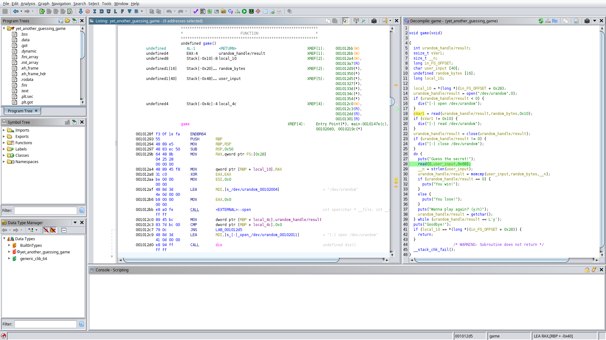

# Yet another guessing game
> ### Category: pwn
>
> The title says it all. Guess the secret!
>
> nc yetanotherguessinggame.challs.open.ecsc2024.it 38010
>
> ### Attachments
> `yet_another_guessing_game.zip`
## Setup
First things first, we must patch `build/yet_another_guessing_game` to actually use the libraries provided by the challenge authors:
```
$ cd build
$ ldd yet_another_guessing_game 
        linux-vdso.so.1 (0x00007ffe70766000)
        libc.so.6 => /lib/x86_64-linux-gnu/libc.so.6 (0x00007fe335149000)
        /lib64/ld-linux-x86-64.so.2 (0x00007fe33535e000)
$ patchelf --set-interpreter ../libs/ld-linux-x86-64.so.2 yet_another_guessing_game 
$ patchelf --replace-needed libc.so.6 ../libs/libc.so.6 yet_another_guessing_game 
$ ldd yet_another_guessing_game 
        linux-vdso.so.1 (0x00007ffd03f7c000)
        ../libs/libc.so.6 (0x00007f7dbed4a000)
        ../libs/ld-linux-x86-64.so.2 => /lib64/ld-linux-x86-64.so.2 (0x00007f7dbef45000)
```
From now on, we have to work in the `build` directory so that the paths to libc and ld are resolved correctly.

We can also run checksec to see which protections are enabled:
```
$ checksec yet_another_guessing_game
[*] '/tmp/yet_another_guessing_game/build/yet_another_guessing_game'
    Arch:     amd64-64-little
    RELRO:    Full RELRO
    Stack:    Canary found
    NX:       NX enabled
    PIE:      PIE enabled
```
As it turns out, all of them are.
## Finding the vulnerability
There are only 3 functions implemented by the author of the challenge: `die` (which exits the program if an error occurs), `main` (which is safe) and `game` which contains a buffer overflow:



The buffer size is 40 bytes, but 0x68 (104) bytes are being read. There are a few important things to note here:

1. As `user_input` has a lower address than `random_bytes`, it's possible to overwrite `random_bytes`
2. Since `read` is used to read the input, we can put null bytes in the input string
3. The number of characters to compare is the length of `user_input` - we can control this value by putting a null byte.

## Exploit idea
Since there is a stack overflow which allows us to overwrite the return address of `game` and a few bytes (24 to be precise) after that, but the `NX` bit is set (we can't execute code from the stack), we will need to perform a ROP attack and use ret2libc to spawn a shell. However, we still need to remember about the stack canary and the fact that the addresses are randomized. Therefore the course of action will be as follows:
1. Leak the canary byte by byte - since we control `user_input`, `random_bytes` and the number of bytes to be compared, we can easily bruteforce every byte of stack canary.
2. Leak the return address of `game` - using the same technique, we can leak the address to which `game` returns.
3. Calculate the base address of the executable - knowing the return address of `game`, we can calculate the base address of `yet_another_guessing_game`.
4. Leak the address of libc - since we know the address of the executable, we can calculate the address of `puts` in PLT and GOT. Now we can create a ROP chain which will load the value from `puts@GOT` to rdi and then call `puts@PLT` which prints the address of `puts` in libc. Finally, we want to return to `game` to perform the next part of the exploit.
5. Calculate the addresses of `system` and the string `/bin/sh` in libc - knowing address of `puts`, we can just use the offsets to calculate these addresses.
6. Having that information, we modify the previous ROP chain to execute `system("/bin/sh")` instead of `puts(got[puts])`.
7. Profit.

## Notes on leaking canary and return address
1. The least significant byte of the canary (i.e. the first byte we encounter, as x64 is little-endian) will always be a null byte - we should replace it with something else when leaking the canary.
2. Two most significant bytes of the return address will always be null bytes.

## Putting it all together
The implementation of this attack is provided in [solve.py](solve.py). The script uses [gdb_plus](https://github.com/Angelo942/gdb_plus), which comes in handy when debugging the exploit locally. To execute the script on a local copy of the file, just run `python3 solve.py`. To execute it on the remote server, use `python3 solve.py REMOTE`.

## Flag
`openECSC{y3t_an0th3r_br0ken_gu3ssing_g4me_d27bb00a}`