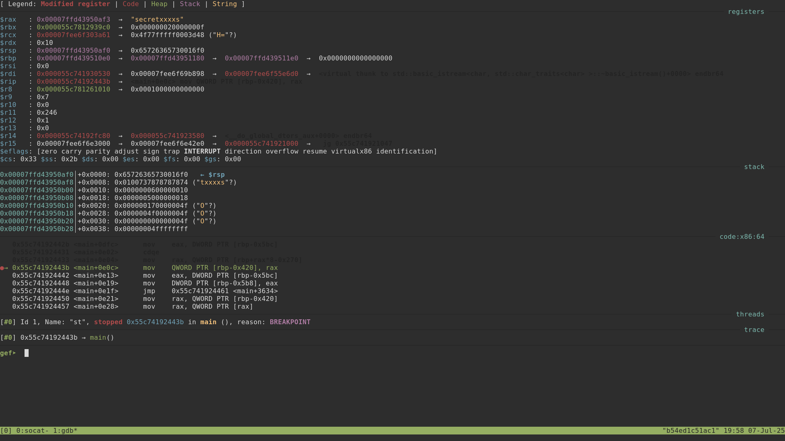

# Sneaky Train

> The game seems to be broken. Could you do some investigation?
>
> `socat STDIO,raw,echo=0,crlf TCP:sneaky-train.ecsc25.hack.cert.pl:5211`
>
> [st](https://hack.cert.pl/files/st-57244772063fbdc886c1f9cfe1fd5b299e61da74)
>
> To run locally:
> ```
> socat TCP-LISTEN:5211,reuseaddr,fork EXEC:./st-57244772063fbdc886c1f9cfe1fd5b299e61da74
> socat STDIO,raw,echo=0,crlf TCP:127.0.0.1:5211
> ```

## Solution
The program is just a snake game with the caveat that it freezes when the snake reaches the length of 5. Looking at some terrible Ghidra-decompiled code:

```c
    length_of_train = std::deque<>::size();
    if (length_of_train == 5) {
      while ((local_5e9 != '\0' || (local_5c4 != 0))) {
        plVar8 = (long *)std::operator>>((basic_istream *)std::cin,&user_input');
        was_character_read =
             std::basic_ios::operator.cast.to.bool
                       ((basic_ios *)((long)plVar8 + *(long *)(*plVar8 + -0x18)));
        if (was_character_read) {
          current_weird_pointer = (char **)(&local_278)[local_5c4];
          local_5c0 = local_5c4;
          while (user_move = local_5c0 + -1, local_5c0 != 0) {
            current_weird_pointer = (char **)*current_weird_pointer;
            local_5c0 = user_move;
          }
          local_3c8 = current_weird_pointer;
          if (*(char *)current_weird_pointer == user_input') {
            local_5e9 = '\0';
            local_5c4 = (local_5c4 + 7) % 10;
            local_5c0 = user_move;
          }
          else {
            local_5e9 = '\x01';
            local_5c4 = 0;
            local_5c0 = user_move;
          }
        }
        std::basic_ios<>::clear(0x10f530);
        usleep(1000);
      }
```

Apparently some 10 obfuscated characters have to be entered to unlock the snake again. Setting a breakpoint at `main+3596`, reaching length 5 and pressing any key after that reveals the whole passphrase loaded in `rax`:



After the passphrase `secretxxxx`, the snake starts moving again. Looking a bit further in the decompiled code:

```c
    length_of_train = std::deque<>::size();
    length_of_flag = std::__cxx11::basic_string<>::length();
    if (length_of_train == length_of_flag) {
      system("clear");
      flag_char_idx = 0;
      for (local_398 = 0; local_398 < 0x18; local_398 = local_398 + 1) {
        local_390 = local_390 & 0xffffffff00000000;
        while ((int)local_390 < 0x50) {
          std::pair<int,int>::pair<>((pair<int,int> *)&key,(int *)&local_390,&local_398);
          pcVar6 = (char *)std::map<>::operator[]((map<> *)&delta_y/board,(pair *)&key);
          if (*pcVar6 == '#') {
            flag_char_idx = flag_char_idx + 1;
            pcVar6 = (char *)std::__cxx11::basic_string<>::operator[]((ulong)flag_string);
            cVar3 = *pcVar6;
          }
          else {
            std::pair<int,int>::pair<>((pair<int,int> *)&delta_x,(int *)&local_390,&local_398);
            pcVar6 = (char *)std::map<>::operator[]((map<> *)&delta_y/board,(pair *)&delta_x);
            cVar3 = *pcVar6;
          }
          std::operator<<((basic_ostream *)std::cout,cVar3);
          local_390 = CONCAT44(local_390._4_4_,(int)local_390 + 1);
        }
        if (local_398 < 0x17) {
          std::operator<<((basic_ostream *)std::cout,"\n");
        }
        std::basic_ostream<>::flush();
      }
    }
```

When the snake's length reaches the length of the flag, the snake's body gets replaced by the flag. Just keep playing until the flag pops out.

## Flag
`ecsc25{all_rights_reversed!!1}`
