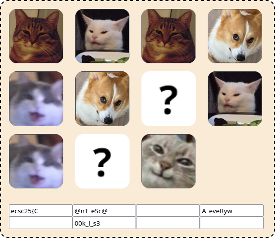

# kumbukumbu

> Help me! My kumbukumbu got all messed up and I think I'm missing some pieces :(.
>
> [index.html](https://hack.cert.pl/files/index-16e46f93a89fcba0997498932000ed7be51e03df.html)

## Solution
The HTML document contains a game of memory that reveals parts of the flag when pairs of identical images are found.



Start by deobfuscating the script using [https://obf-io.deobfuscate.io/](https://obf-io.deobfuscate.io/). Consider the first few functions:
```js
function _0x1e6ea7(_0x115774, _0x5421e9) {
  return _0x5421e9 == 0x0n ? _0x115774 : _0x1e6ea7(_0x5421e9, _0x115774 % _0x5421e9);
}
function _0x266a5a(_0x3b65e6, _0x11d006) {
  return _0x3b65e6 / _0x1e6ea7(_0x3b65e6, _0x11d006) * _0x11d006;
}
function _0x3f767f(_0x20e3c2, _0x1e7f01) {
  if (_0x20e3c2 === 0x0n) {
    return [_0x1e7f01, 0x0n, 0x1n];
  }
  let [_0x1a7e46, _0xc2123a, _0xe3485c] = _0x3f767f(_0x1e7f01 % _0x20e3c2, _0x20e3c2);
  let _0x1f7393 = _0xe3485c - _0x1e7f01 / _0x20e3c2 * _0xc2123a;
  return [_0x1a7e46, _0x1f7393, _0xc2123a];
}
function _0x57bfcd(_0x214371, _0xe8e27a) {
  let [_0x17ce0a, _0x3dc87b, _0x3496c0] = _0x3f767f(_0x214371, _0xe8e27a);
  if (_0x17ce0a !== 0x1n) {
    return null;
  } else {
    _0x3dc87b = (_0x3dc87b % _0xe8e27a + _0xe8e27a) % _0xe8e27a;
    return _0x3dc87b;
  }
}
function _0x26c8d5(_0x395d10, _0x3d802c, _0x313cbc) {
  if (_0x313cbc === 0x1n) {
    return 0x0n;
  }
  let _0x4cf151 = 0x1n;
  _0x395d10 = _0x395d10 % _0x313cbc;
  while (_0x3d802c > 0x0n) {
    if (_0x3d802c % 0x2n === 0x1n) {
      _0x4cf151 = _0x4cf151 * _0x395d10 % _0x313cbc;
    }
    _0x3d802c = _0x3d802c / 0x2n;
    _0x395d10 = _0x395d10 * _0x395d10 % _0x313cbc;
  }
  return _0x4cf151;
}
```

After cleaning up the variable names a bit, it's easy to notice that they're `gcd`, `lcm`, `egcd`, `modinv` and `modpow` respectively. With that knowledge, the first method with obfuscated name of `_0x5b8824` (that is `_0x3ff33b`) seems to be RSA decryption:
```js
'rsa_decrypt'(p, q, node) {
    const c = BigInt(node.getAttribute('c'));
    const n = BigInt(node.getAttribute('id'));
    const phi = lcm(p - 0x1n, q - 0x1n);
    const d = modinv(BigInt(0x10001), phi);
    const pt = modpow(c, d, n);
    node.setAttribute('value', this.parse(pt));
  }
```

The next method (`_0x350526`) is bound as an `onclick` listener later on in the code. Its cleaned-up version looks like this:
```js
  'on_click'(clicked_node) {
    if (this.ready) {
      const the_image = clicked_node.querySelector('img');
      the_image.classList.remove('hidden');
      if (this.selected === null) {
        this.selected = clicked_node;
      } else {
        this.ready = false;
        const id_of_selected = BigInt(this.selected.getAttribute('id'));
        const id_of_div = BigInt(clicked_node.getAttribute('id'));
        const flag_part_node = document.getElementById(id_of_selected * id_of_div);
        if (flag_part_node) {
          this.rsa_decrypt(id_of_selected, id_of_div, flag_part_node);
          this.selected = null;
          this.ready = true;
        } else {
          setTimeout(function () {
            the_image.classList.add('hidden');
            this.selected.querySelector('img').classList.add('hidden');
            this.selected = null;
            this.ready = true;
          }.bind(this), 0x3e8);
        }
      }
    }
  }
```

By now it's pretty clear what's going on: the divs that contain discovered parts of the flag contain a modulus as the id and the ciphertext as an attribute `c`. Corresponding pair of images contains factors of the modulus as the key. 3 images do not have a corresponding pair, but their corresponding flag parts can be found by seeing which moduli are divisible by their ids. The following Python script does exactly that:


```py
from Crypto.Util.number import long_to_bytes
import re

ids = {
    'reassuring': [1167170536952850475909418174911, 885099533904372795874859687719],
    'confused': [778021292426438436606425112727, 1055301397731143498286103730113],
    'paren': [1038934092753097872730253139059],
    'happ': [1033646404229761438304319507287, 1255561944672568469862862185019],
    'sus': [1262714843670806964782879865877, 892852023919058398648656968671],
    'why': [646707326780153459647011532987],
    'easy': [1253977927505847682354254592843]
}

pat = re.compile(r'<input id="(\d+)" c="(\d+)" />')


def parse_answer(ans):
    m = pat.match(ans)
    return (int(m.group(1)), int(m.group(2)))


answers = [parse_answer(x.strip()) for x in '''
<input id="1033062098243884481013064396504107415412074063278620380618009" c="538634309079148116363912301816926031930258573110799122862941" />
<input id="821046957362211211370998260729299679185917409099391209448151" c="562733309494608716994364770937828277740523146074677621141932" />
<input id="1262379843575937484146622348873014780040324339468876243350889" c="319243791255303502020259161971610515049913374771288695699737" />
<input id="1297807089398527074605667633852686491395225225926566312733453" c="941629393855667943649547190044646980315269461850095508227115" />
<input id="1134959194610610450739805279442633776492217914200656484120787" c="914355749731699186791425204706414002614646261411469947941828" />
<input id="1127417503804117426722865115226225402522827590523333870939467" c="558030107305255463640139626217118512514526900834839072384186" />
<input id="525852019748984313817496717882753277681519784980531881219221" c="251738364156397018723696894127984058119319062121032554046180" />
<input id="869835587459822098831531231565804817101360778375336803919757" c="774165720938595325818024236038187794673577169187146034055752" />
'''.split('\n') if len(x.strip()) > 0]

flag_blocks = [None for _ in range(len(answers))]


for tileid, nums in ids.items():
    if len(nums) == 2:
        [p, q] = nums
        phi = (p - 1) * (q - 1)
        n = p * q
        d = pow(0x10001, -1, phi)
        found_anything = False
        for (idx, ct) in [(i, c) for (i, (nn, c)) in enumerate(answers) if nn == n]:
            flag_blocks[idx] = long_to_bytes(pow(ct, d, n))
            found_anything = True
        assert found_anything, tileid
    else:
        p = nums[0]
        for (idx, n, ct) in [(i, nn, c) for (i, (nn, c)) in enumerate(answers) if nn % p == 0]:
            q = n // p
            phi = (p - 1) * (q - 1)
            d = pow(0x10001, -1, phi)
            flag_blocks[idx] = long_to_bytes(pow(ct, d, n))

print(flag_blocks)
print(b''.join(flag_blocks).decode())
```

However, the 5th part (with modulus `1134959194610610450739805279442633776492217914200656484120787`), remains undecrypted. Luckily the factors of this modulus (993312580651766761514801353103, 1142600241573404407687535573629) can be found using [https://factordb.com/](https://factordb.com/) and pasted as a new entry in `ids` dictionary.

## Flag
`ecsc25{C@nT_eSc@p3_mY_r$A_eveRywHeRe_I_l00k_l_s33_it$_Prim3$:((}`
